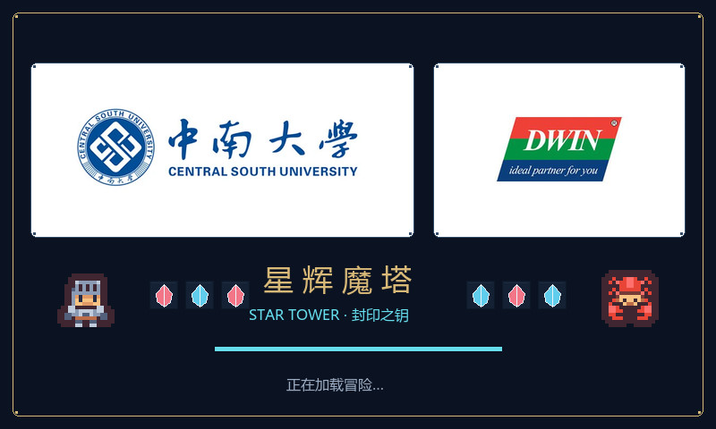

# 星辉魔塔 · 封印之钥

十五层像素魔塔，三套地图按 A→B→C 循环 5 轮，目标单局约 15—30 分钟。开机与加载动画使用你提供的 `logo.webp` 和 `迪文logo.jpg`，完整保留中南大学校徽、校名及迪文 Logo，配合游戏角色、宝石和加载条，没有课程设计字样。

## 工程入口

| 内容 | 文件 / 文件夹 |
|---|---|
| DGUS 可编辑工程 | `GUI\DWprj.hmi`，使用 DGUS V7.648 打开 |
| Keil C51 工程 | `C51\USER\StarTower.uvproj` |
| SD 卡下载包 | 根目录 `DWIN_SET`，9 个文件 |
| 电脑试玩 | `Play.cmd` / `PC_Preview\StarTower.exe` |
| 新 Logo 开机动画 | `Docs\boot_animation.gif` |
| 实际 ICL 解码效果 | `Docs\boot_from_icl.png` |
| 游戏主页面预览 | `Docs\game_preview.png` |
| 三套地图预览 | `Docs\map_A_preview.png`、`map_B_preview.png`、`map_C_preview.png` |
| 登录页面预览 | `Docs\login_preview.png` |
| 页面、图标原图 | `Assets\32_Pages`、`40_Tiles`、`48_HUD` |
| 音乐源文件 / 屏幕音乐库 | `Assets\50_Audio` / `DWIN_SET\50_Music.wae` |
| 本次更新与音乐转换说明 | `Docs\音乐与加载动画.md` |
| 变量地址明细 | `Docs\VP_控件明细.csv` |
| 构建与验证记录 | `Docs\*.log`、`dgus_validation.txt` |

## 游戏内容

1. **A 型地图：横向回廊**。横向折返探索，包含贤者、钥匙、宝石和基础敌人。
2. **B 型地图：纵向兵器库**。纵向折返探索，包含商店、水晶剑和更强敌人。
3. **C 型地图：螺旋封印**。沿螺旋深入中心，需激活紫色水晶、取得红钥匙并通过机关门。

楼层顺序为 A、B、C、A、B、C……直到第 15 层。每轮循环会提升敌人等级；第 15 层在 C 型地图末端出现强化后的赤焰领主，击败后进入终点水晶。

三套地图包含额外宝箱、宝石和药水路线。敌人与物品不会重复刷新；楼层之间可返回，背包可传送到已访问楼层。换层、购买、使用药水、贤者赠礼及通关后自动保存，也支持手动存档。

经典魔塔式确定性战斗：进入相邻敌人格自动交战；手册先显示预计损血。攻击不足或预计损血达到当前生命时拒绝开战，避免误操作直接结束冒险。交战时显示闪光效果，结束后结算属性与奖励。

15—30 分钟是包含阅读、规划与探索的目标时长；没有强制倒计时。熟练后只走主线会更快。

## 上屏

当前按 **EKT043E（T5L0、800×480、16 MB Flash、板载蜂鸣器）** 配置。`T5LCFG.CFG` 只配置常用系统参数，显示和触摸硬件参数启用位保持关闭，使用屏幕出厂设置。

按 `Docs\烧录与验收.md` 操作，将根目录的 `DWIN_SET` 复制到 FAT32、4 KB 分配单元的 SD 卡根目录，给屏幕断电后插卡，再上电下载。下载结束后断电拔卡再开机。

**已验证**：Keil 命令行编译 0 错误、0 警告；登录的不完整输入、错误密码和默认凭据成功路径均通过；15 层三地图循环主线可通关；320 字节 v2 存档 CRC 和交互规则测试通过；电脑端双槽存档及最新槽损坏后的旧槽恢复通过；26 个 DGUS 页面、262 个控件可由原生序列化器加载；162 张 ICL 图片可由原生解码器读取。

**尚未验证**：真实屏幕上的音乐播放、循环间隙、触摸反馈、刷新速度、NOR 自动存档和断电恢复。电脑测试通过不等于已经完成实机烧录。实际验收步骤和预期结果见烧录文档。

## 本次更新：双 Logo、音乐与加载动画

- 开机动画结束后进入登录页，账号和密码均为 6 位数字；初始账号、密码都是 `123456`。密码只显示圆点，验证失败后清空输入并停留在登录页。
- 开机、暂停返回首页、通关返回首页、上下楼梯和背包传送，共用 15 帧、约 3 秒的加载动画；根据来源进入首页或目标楼层。加载期间不响应操作，也不增加游戏用时。
- 暂停返回首页前先保存；保存失败会留在暂停页，提示重试。已通关记录也会先保存再返回首页。
- 四段针对 EKT043E 板载蜂鸣器优化的单音像素风配乐：启动 3 秒、探索 16 秒循环、最终层 16 秒循环、通关 4 秒。采用约 2.1—2.8 kHz 方波和清晰休止，不再使用蜂鸣器难以还原的低音、和弦与鼓点。首页与暂停页可选关闭、轻柔、标准、明亮；暂停自动降低音量。
- 音量与 320 字节 v2 冒险存档一起保存。首页调整音量会用于新冒险；继续冒险会恢复该存档中的音量。旧 5 层存档因地图结构不兼容会自动失效。
- 低生命心形闪烁、方向键按下反馈、遇敌后手册自动定位该敌人。

WAE 的容器布局来自迪文官方 **AllTool.exe → WAE 工具 → 32KHz 16bit WAV** 导出。响度修复后，`build_all.cmd` 会把四个等长 WAV 的 PCM 刷新进该容器、重算 CRC，并验证 SHA-256、曲目索引和 PCM 内容，防止电脑与屏幕音乐版本不同；改变曲目数量或长度时仍需用官方工具重新建立容器。
