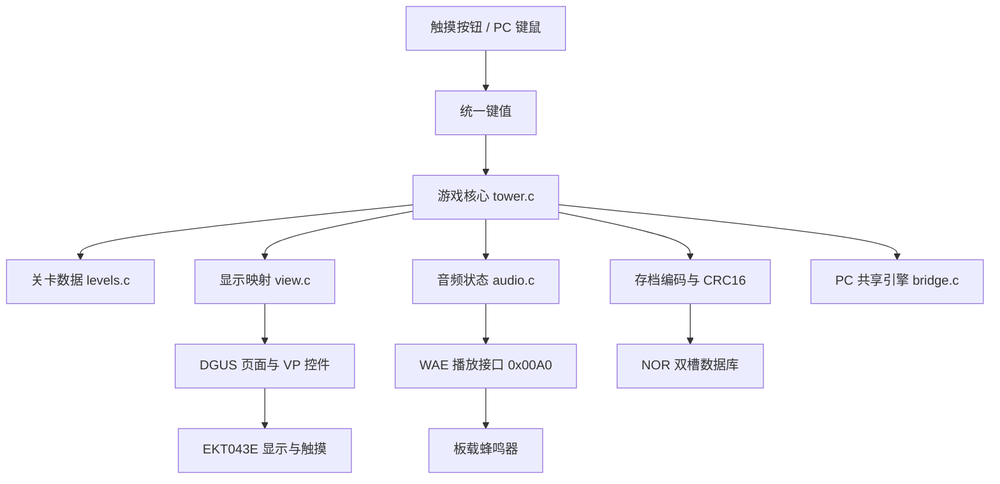
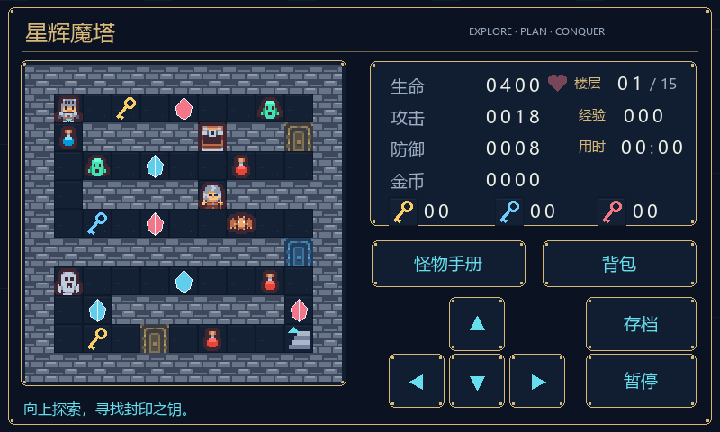
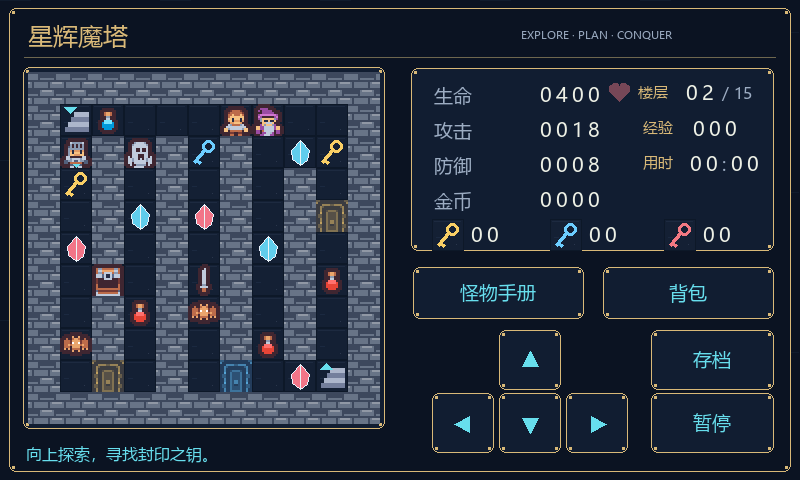
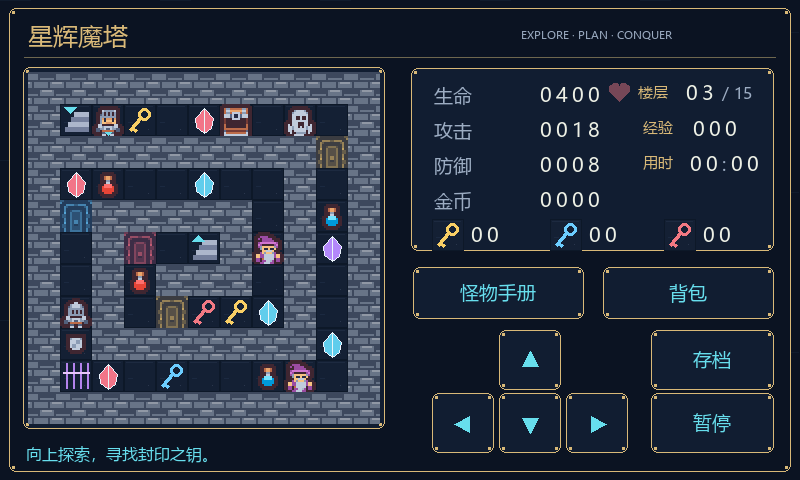
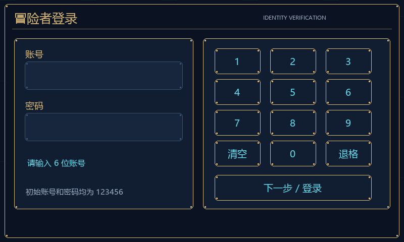

# 基于 DWIN T5L0 智能屏的魔塔游戏设计与实现

> 项目名称：星辉魔塔·封印之钥  
> 硬件平台：EKT043E（T5L0，800×480，16 MB Flash，板载蜂鸣器）  
> 开发方式：DGUS II 界面开发 + T5L OS CPU（C51）应用开发  
> 

## 摘要

本项目面向迪文 EKT043E 智能屏，设计并实现了一款名为“星辉魔塔·封印之钥”的十五层像素风魔塔游戏。系统以 DGUS II 负责页面、触摸控件和变量图标显示，以 T5L0 的 8051 OS CPU 负责登录验证、游戏状态机、地图交互、战斗计算、存档和音乐调度。游戏采用 11×11 网格地图，三套不同布局按 A→B→C 循环 5 轮，包含账号密码登录、钥匙与门、六类敌人、宝石与装备、机关、商店、怪物手册、背包传送、暂停、通关统计等功能，目标单局时长约为 15～30 分钟。

针对嵌入式平台 RAM 和 Flash 资源有限、触摸界面需要及时刷新、断电时存档不能损坏以及 EKT043E 仅配有板载蜂鸣器等约束，项目分别采用只读地图、差量 VP 刷新、双槽 NOR 存档加 CRC16 校验、面向蜂鸣器共振频段的单音方波配乐等方案。项目还提供与屏幕端共用核心 C 代码的 Windows 试玩程序，并建立了从音乐、图片、DGUS 工程、ICL 资源、C51 固件到下载包的自动化构建与验证流程。

软件测试结果表明：默认账号密码登录、不完整和错误输入、十五层三地图循环主线、战斗、商店、机关、传送、v2 存档和异常存档回退等逻辑均通过测试；Keil C51 编译结果为 0 错误、0 警告；DGUS V7.648 原生序列化器可加载 26 个页面、262 个控件，原生 ICL 解码器可回读 162 张图片；WAE 音频的文件头、曲目索引、CRC、PCM 内容和 Flash 地址分配全部通过校验。真实屏幕上的声音响度、触摸位置、刷新速度和断电恢复仍需结合实机完成最终验收。

**关键词：** DWIN；T5L0；DGUS II；C51；魔塔游戏；NOR 存档；WAE；蜂鸣器

## 1. 项目概述

### 1.1 项目背景

EKT043E 是一块分辨率为 800×480 的 4.3 英寸迪文智能屏，采用 T5L0 芯片并提供 16 MB Flash。与普通单片机直接逐像素绘图不同，DGUS II 可以预先组织页面、触摸控件和图片资源，运行时通过 VP（Variable Pointer，变量地址）更新界面内容；同时，T5L 的 OS CPU 可运行用户 C51 程序。因此，该平台适合实现具有固定页面布局、较多图片资源和明确状态流程的嵌入式交互应用。

传统二维演示程序通常只包含页面切换或简单按键响应，难以综合体现图形界面、数据处理、资源管理和可靠存储。本项目选择经典魔塔玩法，在有限硬件资源上实现一套完整且可通关的游戏，用于综合验证 DGUS 页面设计、VP 数据交互、C51 状态机、NOR 数据库和音频播放等能力。

### 1.2 设计目标

项目的主要目标如下：

1. 在 EKT043E 上实现一局约 15～30 分钟、规则完整的十五层魔塔游戏，并让三套地图每三层循环一次。
2. 支持触摸操作、确定性战斗、道具收集、商店成长、机关解谜和通关统计。
3. 支持自动与手动存档，并能在最新存档损坏时恢复上一份有效记录。
4. 提供与屏幕端共用游戏核心的电脑试玩程序，便于调试规则和数值。
5. 针对板载蜂鸣器生成清晰可辨的背景旋律，并提供四档音量控制。
6. 建立可重复执行的构建、测试和下载包校验流程，降低资源编号或文件版本不一致的风险。

### 1.3 最终成果

工程最终包含以下可交付内容：

- 可由 DGUS V7.648 打开的界面工程 `GUI/DWprj.hmi`；
- 可由 Keil C51 打开的程序工程 `C51/USER/StarTower.uvproj`；
- 可直接复制到 SD 卡的 9 文件下载包 `DWIN_SET`；
- Windows 电脑试玩程序 `PC_Preview/StarTower.exe`；
- 图片、音乐、地图等源素材及其自动生成脚本；
- 构建日志、变量地址表、烧录说明和测试记录。

## 2. 需求分析

### 2.1 功能需求

| 模块 | 功能要求 |
|---|---|
| 启动与首页 | 显示中南大学与迪文 Logo、游戏标题和约 3 秒加载动画；支持新冒险、继续冒险、帮助和音量设置 |
| 地图探索 | 在三套循环使用的 11×11 地图中探索十五层，正确处理墙、门、楼梯、物品、NPC、机关和敌人 |
| 战斗系统 | 接近敌人后自动计算战斗；显示预计损血；攻击不足或战斗必死时拒绝开战 |
| 成长系统 | 拾取生命、攻击、防御宝石以及水晶剑、秘银盾；在商店用金币购买属性 |
| 辅助功能 | 支持六类敌人的怪物手册、药水背包、已访问楼层传送、提示信息和通关统计 |
| 存档系统 | 支持手动保存，并在换层、购买、用药、贤者赠礼、返回首页和通关时自动保存 |
| 音乐系统 | 启动、探索、最终层和通关使用不同曲目；支持关闭、轻柔、标准、明亮四档音量 |
| 暂停系统 | 暂停时停止游戏计时、降低音乐音量；返回首页前必须先成功保存 |
| 电脑预览 | 使用同一套游戏核心代码模拟页面与操作，支持键盘、鼠标和文件存档 |

### 2.2 非功能需求

1. **实时性：** 主循环周期为 50 ms，按键、页面和状态变化应在可接受时间内响应。
2. **可靠性：** 存档写入后必须回读比较并校验 CRC，单个槽损坏不能导致全部进度丢失。
3. **资源约束：** 地图和敌人表放入 code 区，减少有限 xdata 的占用；图片和音乐库不得发生 Flash 地址重叠。
4. **可维护性：** 游戏规则、地图、显示映射、音频状态和硬件接口分模块实现，资源通过脚本统一生成。
5. **一致性：** 电脑端和屏幕端共用 `tower.c`、`levels.c`、`view.c`、`audio.c`，减少两套逻辑产生差异的可能。
6. **可验证性：** 每次构建必须自动执行规则测试、持久化测试、DGUS/ICL/WAE 校验和下载包检查。

## 3. 开发平台与工程结构

### 3.1 硬件平台

| 项目 | 参数或用途 |
|---|---|
| 智能屏 | DWIN EKT043E |
| 主控 | T5L0 |
| 显示分辨率 | 800×480，横屏 0° |
| Flash | 16 MB，用于页面、图标、WAE 音频和系统文件 |
| 人机交互 | 电容触摸屏 |
| 声音器件 | 板载蜂鸣器，不具备普通扬声器的全频带还原能力 |
| 图形侧 | DGUS II 页面、变量显示和触摸控件 |
| 逻辑侧 | T5L OS CPU 用户 C51 程序 |

### 3.2 软件工具

| 工具 | 用途 |
|---|---|
| DGUS V7.648 | 编辑 DGUS 工程、生成并原生加载页面和控件数据 |
| Keil C51 V9.54 | 编译、链接 T5L 8051 用户程序 |
| Python 3.13 | 生成地图、音频、图片、GUI 数据、ICL、清单并执行校验 |
| MinGW64 | 编译供电脑试玩程序调用的共享 C 游戏引擎 |
| .NET Framework 4 | 构建 Windows 试玩界面 |
| DwinPCKits AllTool | 建立官方 WAE 容器 |

### 3.3 工程目录

| 路径 | 内容 |
|---|---|
| `Assets` | 页面、图标、Logo、关卡 JSON、WAV 源文件和素材授权 |
| `C51/USER` | 游戏核心、硬件入口、底层接口和 Keil 工程 |
| `GUI` | DGUS 可编辑工程、控件数据和编辑用资源 |
| `DWIN_SET` | 最终 SD 卡下载包 |
| `PC_Preview` | Windows 试玩程序、共享引擎及电脑端存档 |
| `Tests` | 游戏规则和边界条件测试 |
| `Tools` | 全量构建、资源生成、打包和校验脚本 |
| `Docs` | 截图、动画、地址表、构建日志和验收文档 |

## 4. 系统总体设计

### 4.1 总体架构

系统分为资源层、界面层、游戏核心层、硬件适配层和验证层。DGUS 负责静态页面与变量图标，C51 程序维护唯一的游戏状态并通过 VP 与界面交换数据。



这种结构使游戏规则不依赖某一种显示后端。屏幕端的 `main.c` 处理 DGUS、NOR 和 WAE 接口，电脑端的 `bridge.c` 则把相同状态导出给 C# 界面；两端都不重复实现战斗和地图规则。

### 4.2 主循环设计

屏幕程序启动后首先初始化系统、等待硬件稳定、清零按键 VP、扫描两份存档并恢复音量设置，然后进入永久循环。每轮主要完成以下工作：

1. 根据游戏状态决定当前 DGUS 页面，页面变化时写入系统页面切换 VP `0x0084`；
2. 在地图页更新 121 个地图格，并刷新生命、攻防、金币等状态 VP；
3. 延时 50 ms，读取按键 VP `0x1000`，读取后立即清零；
4. 调用 `tower_tick()` 推进游戏状态机；
5. 处理 NOR 读写请求；
6. 处理音乐切换、音量变化和循环播放。

界面刷新采用缓存比较方式。程序为显示数据分配 208 个字的缓存，其中 203 个字有效；只有新值与缓存不同的 VP 才会写入屏幕。该方法避免每 50 ms 全量刷新所有控件，降低总线通信量与画面闪烁。

### 4.3 页面状态设计

游戏逻辑定义了启动、首页、地图、手册、商店、背包、帮助、通关、暂停、对话和登录 11 种主要状态。DGUS 工程共有 26 个页面，其中页面 10 是登录页，页面 11～25 是 15 帧加载动画。启动状态根据 `boot_tick/4` 选择动画帧，每帧保持 4 个 50 ms 周期，因此完整动画约为：

$$15\times4\times50\ \text{ms}=3000\ \text{ms}$$

`boot_target` 决定动画结束后进入登录页、首页还是目标楼层。首次开机动画结束进入登录页，用户依次输入 6 位账号和 6 位密码；初始凭据均为 `123456`。密码字段只显示圆点，输入不完整或验证失败时停留在登录页。验证成功后进入首页，会话内返回首页不重复登录。加载状态直接忽略触摸输入，从而避免连续点击导致跨层、误操作或状态不同步。

## 5. DGUS 界面与资源设计

### 5.1 页面划分

| 页面号 | 页面用途 |
|---:|---|
| 0 | DGUS 初始页 |
| 1 | 游戏首页 |
| 2 | 地图与角色属性页 |
| 3 | 怪物手册 |
| 4 | 商店 |
| 5 | 背包与楼层传送 |
| 6 | 帮助 |
| 7 | 通关统计 |
| 8 | 暂停 |
| 9 | 对话与新游戏确认 |
| 10 | 账号密码登录与数字键盘 |
| 11～25 | 开机、换层和返回首页共用的 15 帧加载动画 |

游戏地图左上角位于画面坐标 `(28,72)`，每格为 32×32 像素，共 11 行、11 列。右侧区域固定显示楼层、生命、攻击、防御、金币、经验、钥匙、药水和功能按钮。地图和数字使用变量图标控件，并启用覆盖背景的显示方式，角色移动后原位置能恢复地板，不留下图像残影。



三套地图分别采用横向折返、纵向折返和向内螺旋结构：








### 5.2 VP 地址规划

VP 采用 16 位字地址，发送数据为大端字节序。主要地址如下：

| VP 地址 | 数据内容 |
|---|---|
| `0x1000` | 触摸按钮键值，OS 读取后清零 |
| `0x1100`～`0x11C3` | 生命、攻防、金币、经验、钥匙、药水、楼层、时间、击败数和步数 |
| `0x1200`～`0x1243` | 怪物生命、攻防、金币和预计损血 |
| `0x1300`～`0x1380` | 提示、敌人、对话、音量、低生命、方向反馈、登录数字与登录提示 |
| `0x2000`～`0x2078` | 121 个地图图标，按行优先排列 |
| `0x3000`～`0x309F` | 160 字的 NOR 存档传输缓冲区 |
| `0x00A0`～`0x00A3` | DGUS WAE 音乐播放与状态接口 |

属性数值按十进制位分别映射为图标。例如生命值 1987 会向四个相邻 VP 分别写入 1、9、8、7，而不是直接显示一个数值。这使界面可以保持统一的像素字体风格。

### 5.3 Flash 资源分配

| 资源文件 | 图片或曲目数 | Flash 编号 | 文件大小 |
|---|---:|---:|---:|
| `32_Pages.icl` | 26 张页面 | 32～38 | 1,670,184 字节 |
| `40_Tiles.icl` | 48 张地图、角色与头像 | 40 | 92,492 字节 |
| `48_HUD.icl` | 88 张数字、文字、对话与登录图标 | 48 | 248,952 字节 |
| `50_Music.wae` | 4 段音乐 | 50～59 | 2,510,848 字节 |

三个 ICL 共包含 162 张图片。页面源图为 RGB24 BMP，打包时采用 baseline JPEG、质量 90%、4:4:4 采样。最大单图为 82,186 字节，低于当前硬件限制。各资源库地址之间保留间隔，音乐结束于 59，60～63 仍为空闲区。

## 6. 游戏核心设计

### 6.1 游戏状态数据

全局结构体 `Tower` 保存当前页面、楼层、位置、方向、三类钥匙、已访问楼层、机关状态、装备、药水、角色属性、击败数、步数、计时、战斗过程、登录输入、存档请求、音量等级和加载目标等数据。三套地图模板、三条路线和六类敌人的基础属性声明为只读 `code` 数据，从而减少 xdata 消耗。

地图中的每个格子用一个枚举值表示，包含地板、墙、三色门、上下楼梯、三色钥匙、生命/攻击/防御道具、剑、盾、宝箱、机关、六类敌人、商店、贤者、机关门和终点。每套模板占 121 字节，三套基础地图共 363 字节；逻辑楼层通过 `floor % 3` 选择模板，避免为 15 层重复存储相同地图。

已经取得的物品、打开的门和击败的敌人不直接改写只读地图，而是记录在 240 字节 `cleared` 位图中。每个逻辑楼层预留 16 字节，可表示 128 个位置，覆盖实际的 121 个格子；因此即使地图模板循环，15 层的清除状态仍彼此独立。读取地图时先检查对应位；若已清除，则返回地板。

### 6.2 关卡与流程

十五层关卡由三套地图按 A→B→C 顺序循环 5 轮：

1. **A 型“横向回廊”：** 横向折返路线，包含贤者、钥匙、宝石和基础敌人。
2. **B 型“纵向兵器库”：** 纵向折返路线，包含商店、水晶剑和更强敌人。
3. **C 型“螺旋封印”：** 向中心收拢的螺旋路线，需激活紫水晶、取得红钥匙并通过机关门。

每完成 A、B、C 三层即进入下一轮，敌人类型随轮次提升，最高提升到黑甲守卫。第 15 层在 C 型地图末端将普通敌人替换为强化赤焰领主，击败后才能进入终点水晶。

楼梯和背包传送均只允许到达合法楼层。背包不能传送到尚未访问的楼层；机关门必须在当前层激活开关后才能通过。可拾取物和敌人只结算一次，商店购买、药水使用和贤者赠礼均会触发存档。

### 6.3 战斗算法

本项目采用经典魔塔的确定性战斗。设玩家攻击、防御和生命分别为 $A_p$、$D_p$、$H_p$，怪物生命、攻击和防御分别为 $H_m$、$A_m$、$D_m$。当 $A_p\le D_m$ 时玩家无法对怪物造成伤害，系统返回不可战斗。

玩家每次攻击造成：

$$D_{p\rightarrow m}=A_p-D_m$$

击败怪物所需攻击次数为：

$$N=\left\lceil\frac{H_m}{D_{p\rightarrow m}}\right\rceil$$

普通怪物每次反击造成：

$$D_{m\rightarrow p}=\max(A_m-D_p,0)$$

法师类怪物使用一半玩家防御，即将有效防御改为 $\lfloor D_p/2\rfloor$。由于玩家最后一次攻击后怪物不能反击，预计总损血为：

$$L=(N-1)\times D_{m\rightarrow p}$$

当 $L\ge H_p$ 时系统提示生命不足并拒绝战斗，避免一次误触直接结束冒险。允许战斗后，程序保持 16 个主循环周期的闪光效果，约 0.8 秒后统一扣除生命、发放金币和经验、增加击败数并清除敌人。

### 6.4 数值与边界处理

初始属性为生命 400、攻击 18、防御 8，并携带 1 瓶药水。生命、攻击、防御、金币和经验上限统一限制为 9999，钥匙和药水上限为 99。加法通过 32 位临时变量计算后再饱和到上限，避免 16 位溢出。游戏不存在随机伤害，因此怪物手册中的预计损血与实际结果一致，玩家可以通过路线和资源规划完成关卡。

计时仅在地图、手册、商店和背包等冒险页面推进；暂停、帮助、首页和加载动画不计入游戏时间。计时上限为 5999 秒，显示格式为 MMSS。

## 7. 存档系统设计

### 7.1 存档数据格式

每份存档固定为 320 字节，当前格式版本为 v2。主要字段如下：

| 偏移 | 内容 |
|---:|---|
| 0～1 | 魔数 `0x5354`（“ST”） |
| 2～3 | 格式版本 2 |
| 4～5 | 递增序号 |
| 6～9 | 楼层、位置、方向和保留字节 |
| 10～19 | 生命、攻击、防御、金币、经验 |
| 20～27 | 钥匙、装备、药水和任务状态 |
| 28～34 | 击败数、步数、用时和通关标志 |
| 35～36 | 音量扩展标记 `0xA7` 与音量档位 |
| 38～39 | 15 位已访问楼层位图 |
| 40～41 | 15 位逐层机关状态 |
| 42～281 | 十五层地图清除位图 |
| 282～317 | 保留区域 |
| 318～319 | 前 318 字节的 CRC16 |

由于楼层数和地图结构已经变化，旧版 5 层 v1 存档会被自动判为无效，避免把旧位置和清除位图错误套用到新地图。程序还检查楼层、位置、方向、属性范围、15 位位图范围和当前位置是否为墙等语义条件，不能只凭 CRC 相同就接受非法数据。

### 7.2 NOR 双槽机制

屏幕端通过系统 VP `0x0008` 的数据库接口访问片内 NOR，两个槽使用字地址 `0x020000` 和 `0x021000`，相隔 8 KB。传输缓冲区为 VP `0x3000`～`0x309F`，共 160 字，即 320 字节。

保存时不覆盖当前有效槽，而是写入另一个槽：

1. 将游戏状态编码为 320 字节并生成新的序号和 CRC16；
2. 把数据写入非活动槽；
3. 从该槽回读到另一缓冲区；
4. 检查格式、语义、CRC，并逐字节比较写入和回读内容；
5. 全部成功后才把新槽标记为当前有效槽。

启动时分别读取两槽。如果只有一份有效，则使用该份；如果两份都有效，则根据 16 位序号选择较新的一份，并处理序号回绕。这样即使写入过程中断电，旧槽仍可作为恢复点。电脑端采用相同的 320 字节格式和双文件轮换策略，用于提前测试损坏回退逻辑。

## 8. 板载蜂鸣器音乐设计

### 8.1 问题分析

EKT043E 只有板载蜂鸣器，没有独立扬声器和功率放大音频通道。普通背景音乐即使在数字文件中已归一化到较高幅度，也包含低音、和弦、鼓点和宽频谱内容；这些成分超出小型蜂鸣器的有效频段后会被严重衰减，表现为声音很小、旋律模糊，单纯继续放大 PCM 还可能造成削波而不能改善听感。

因此，本项目不是继续提高普通音乐的整体增益，而是重新设计适合蜂鸣器的声源：使用约 2.1～2.8 kHz 的单音方波，删除低音、和弦、噪声鼓和同时发声，并使用明显的起音和休止增强节奏辨识度。该频段围绕资料中常见的约 2.5 kHz 蜂鸣器工作点，但具体共振峰仍需在实际 EKT043E 上试听确认。

### 8.2 曲目与音量

| 编号 | 曲名 | 长度 | 使用场景 | RMS |
|---:|---|---:|---|---:|
| 0 | 星门启程 | 3 s | 开机及所有加载动画 | -2.26 dBFS |
| 1 | 星辉回廊 | 16 s | 首页、普通楼层和功能页，循环 | -3.24 dBFS |
| 2 | 赤焰王座 | 16 s | 第十五层及相关功能页，循环 | -4.71 dBFS |
| 3 | 星辉重现 | 4 s | 通关页，单次播放 | -2.24 dBFS |

四首音乐均为项目原创并由 `Tools/build_audio.py` 合成，格式为 32000 Hz、单声道、16 bit PCM WAV，峰值归一化到 0.95，约保留 0.45 dBFS 余量。音量档位对应硬件值 0、32、52、64；暂停页自动使用当前音量的一半。

### 8.3 WAE 播放控制

CFG 的 `0x05` 设置为 `0x60`，启用 WAE 音乐模式并加载 22 号初始变量文件；`0x07` 设置为 `0x32`，指定 50 号 WAE 库。虽然硬件输出器件是蜂鸣器，这里仍保留音乐模式，因为普通蜂鸣器模式只能控制固定频率鸣叫的时长，不能表现旋律中的不同音高。

C51 程序向系统 VP `0x00A0` 写入“曲目号、播放命令、音量、保留字节”发起播放，并读取 `0x00A1` 的低字节判断播放状态。切换页面或楼层时立即选择相应曲目；探索和最终层曲目结束后自动重发播放命令。曲目切换后设置 6 个 tick 的等待窗口，避免硬件反馈尚未更新时重复触发。

WAE 容器最初由官方 AllTool 按“32KHz 16bit WAV”建立。只要曲目数量和长度不变，构建脚本会把新 PCM 写入已有容器、保持 4 KB 对齐、重算 CRC，并验证源 WAV 与 WAE 内容一致；如果改变曲目数量或长度，则需重新使用官方工具建立容器。

## 9. 视觉素材与交互细节

启动动画同时保留中南大学校徽、校名和迪文 Logo 的完整比例，并加入游戏角色、宝石、标题和加载条。开机、上下楼、背包传送、暂停返回首页和通关返回首页共用同一组 15 帧资源，减少重复占用 Flash。


角色、怪物、门和宝箱等像素素材来自 Kenney Tiny Dungeon（CC0），原始 16×16 图块采用最近邻方法放大为 32×32，避免像素边缘变模糊；地板、钥匙、宝石、楼梯、闪光、方向符号、页面边框和按钮由项目脚本生成。中文文字在构建时栅格化为图片，从而不依赖屏幕端中文字库。

为增强触摸反馈，项目增加了方向键短时高亮、低生命心形闪烁和遇敌后怪物手册自动定位。暂停返回首页采用“先保存、后加载”的顺序：只有收到存档成功回调才播放返回动画，失败时保留当前页面并显示错误，避免界面已返回首页但进度没有保存。

## 10. 自动化构建与下载

### 10.1 构建流程

在项目根目录运行：

```bat
Tools\build_all.cmd
```

脚本按以下顺序执行，任一环节失败都会停止构建并在 `Docs` 中保留日志：


这种方式把地图、控件、图片索引、音频索引和下载清单作为可重复生成的结果，避免手工修改多个副本造成版本不一致。需要注意的是，ICL 使用本项目实现的命令行兼容打包器生成，并通过 DGUS V7.648 的原生 `GetICO` 解码器逐图回读校验；它不是官方软件提供的批处理接口。

### 10.2 下载包

| 文件 | 作用 |
|---|---|
| `13TouchFile.bin` | 44 个触控按钮定义 |
| `14ShowFile.bin` | 218 个显示控件及页面索引 |
| `22_Config.bin` | 初始 VP 数据 |
| `32_Pages.icl` | 页面与加载动画 |
| `40_Tiles.icl` | 地图、角色、敌人和头像 |
| `48_HUD.icl` | 数字、文字、提示和状态图标 |
| `50_Music.wae` | 四段蜂鸣器优化配乐 |
| `T5L51.bin` | T5L OS CPU 用户程序 |
| `T5LCFG.CFG` | 启动图片库、方向、报点和音乐模式配置 |

9 个文件合计 4,691,700 字节。下载包不包含底层 `T5L_UI` 或 `T5L_OS` 固件，使用屏幕原有可运行 DGUS2 和 8051 用户程序的底层版本。

### 10.3 SD 卡下载步骤

1. 准备 FAT32、4096 字节分配单元的 SD 卡；如需格式化，应先备份卡内原有数据。
2. 将项目根目录的整个 `DWIN_SET` 文件夹复制到 SD 卡根目录，不混入其他工程的同号资源。
3. 屏幕断电后插卡，再上电等待下载完成。
4. 下载完成后断电、拔卡并重新上电。
5. 检查双 Logo 加载动画、首页触摸、地图显示、音乐、存档和通关流程。

## 11. 测试与结果分析

### 11.1 软件测试结果

| 测试类别 | 验证内容 | 结果 |
|---|---|---|
| C51 编译 | 7 个 C/汇编模块、链接和 HEX 转 BIN | 0 错误、0 警告 |
| 程序规模 | Keil 链接结果 | data=11 B，xdata=1413 B，code=13333 B；`T5L51.bin` 为 13336 B |
| 主线流程 | 十五层三地图循环、无商店路线、最终 Boss 和终点 | 通过，通关时 HP=1343、ATK=163、DEF=118、金币=2276、击败 61 |
| 战斗与成长 | 损血公式、法师特性、致死拒绝、属性上限、奖励 | 通过 |
| 交互规则 | 门、钥匙、机关、贤者、商店、药水、传送、物品不重复 | 通过 |
| 页面状态 | 登录完整性与凭据验证、新游戏确认、暂停、加载输入锁定、返回首页保存成功/失败 | 通过 |
| 存档编码 | 320 字节 v2 格式、CRC、语义检查、旧版拒绝 | 通过 |
| PC 双槽存档 | 轮换保存、读取最新槽、最新槽损坏后回退 | 通过 |
| 音乐逻辑 | 曲目切换、循环等待、静音、四档音量、暂停降音量 | 通过 |
| WAE 文件 | 文件头、CRC、4 个曲目索引、源 SHA-256、PCM 和 Flash 50～59 | 通过 |
| DGUS 工程 | 原生序列化器加载页面和控件 | 26 页、262 控件通过 |
| ICL 文件 | 原生 GetICO 解码并核对尺寸 | 162 张图片通过 |
| 下载包 | 控件地址、透明重绘、资源分配、固件签名和 CFG | 通过 |

十五层主线回归测试的逐层状态如下：

| 完成楼层 | 生命 | 攻击 | 防御 | 金币 | 累计击败 |
|---:|---:|---:|---:|---:|---:|
| 1 | 473 | 24 | 12 | 46 | 4 |
| 2 | 506 | 38 | 16 | 112 | 8 |
| 3 | 626 | 47 | 30 | 256 | 12 |
| 4 | 763 | 53 | 34 | 322 | 16 |
| 5 | 893 | 67 | 38 | 420 | 20 |
| 6 | 1158 | 76 | 52 | 598 | 24 |
| 7 | 1305 | 82 | 56 | 696 | 28 |
| 8 | 1453 | 96 | 60 | 820 | 32 |
| 9 | 1733 | 105 | 74 | 1012 | 36 |
| 10 | 1883 | 111 | 78 | 1136 | 40 |
| 11 | 2033 | 125 | 82 | 1288 | 44 |
| 12 | 2313 | 134 | 96 | 1480 | 48 |
| 13 | 2463 | 140 | 100 | 1632 | 52 |
| 14 | 2613 | 154 | 104 | 1784 | 56 |
| 15 | 1343 | 163 | 118 | 2276 | 61 |

测试表明主线在不依赖商店的情况下也可通关，因此不会因某一次非最优购买形成必然死局；商店、支路宝箱和药水则为不同玩家提供额外容错与策略选择。


## 12. 设计特点、不足与改进方向

### 12.1 设计特点

1. **核心逻辑跨平台复用。** 屏幕端和 PC 端共享游戏、关卡、显示和音频状态代码，调试结果具有较高一致性。
2. **存档可靠性较高。** 双槽轮换、写后回读、逐字节比较、CRC 和语义校验共同降低异常数据被接受的概率。
3. **嵌入式资源使用清晰。** 地图位图化记录、code 区只读数据、差量 VP 刷新和固定 Flash 编号适合资源有限的平台。
4. **针对具体硬件处理音频。** 从“提高文件音量”转向“匹配蜂鸣器有效频段和波形”，解决普通全频音乐不适合板载蜂鸣器的问题。
5. **构建结果可追溯。** 关键文件记录字节数、SHA-256、CRC、曲目索引和图片回读结果，便于定位下载包版本问题。

### 12.2 当前不足

1. 游戏仍采用二维正交俯视地图，画面层次主要依赖像素素材与界面装饰，空间表现有限。
2. 十五层由三套布局循环构成，虽有逐轮敌人升级，但后续仍可继续增加专属楼层机制；敌人行为为静态阻挡和确定性战斗，没有移动 AI。
3. 背景音乐受板载蜂鸣器物理结构限制，只能使用高频单音旋律，无法达到扬声器的音色和动态范围。
4. 当前自动更新 WAE PCM 的流程要求曲目数量和长度不变，结构变化时仍需官方工具重新建立容器。
5. 尚未完成真实 EKT043E 的整机验收，特别是音频共振、触摸、NOR 断电恢复和刷新性能。

### 12.3 后续改进方向

1. 在不改变魔塔规则的前提下，把地图素材升级为带墙体厚度、投影和高度差的俯视伪立体风格；若资源允许，可进一步采用等距 2.5D 表现。
2. 制作 1.8～3.2 kHz 分段扫频的蜂鸣器校准曲，先测出实机最响频段，再对四首旋律整体移调。
3. 增加隐藏房间、装备选择和多结局，并为后续循环加入更多专属机关，同时保持确定性战斗和可计算路线。
4. 在实机压力测试中记录页面刷新时间、NOR 写入耗时和触摸丢报率，形成量化验收数据。
5. 如硬件条件允许，可增加外接扬声器和功率放大电路，保留当前蜂鸣器版作为兼容音频方案。

## 13. 结论

本项目完成了基于 EKT043E/T5L0 的十五层魔塔游戏设计与实现。系统以三套不同地图循环构成十五个独立进度层，将 DGUS II 的页面与触摸能力、C51 游戏状态机、NOR 双槽存档、WAE 音乐和自动化资源构建结合在一个完整工程中，并通过 Windows 同源预览和多层校验提高开发效率与结果可靠性。

从现有测试结果看，游戏规则、十五层循环流程、页面控件、图片资源、固件、音频容器和下载包已经形成闭环，具备烧录到目标屏幕进行整机测试的条件。项目的主要工程价值不仅是实现了可玩的魔塔，还在于对嵌入式图形界面的状态管理、模板化关卡复用、资源地址规划、异常存档保护和受限声音器件适配进行了较完整的实践。后续工作的重点应放在实机量化验收、蜂鸣器共振校准以及视觉层次升级上。


## 附录 A：主要操作键值

| 键值 | 功能 | 键值 | 功能 |
|---:|---|---:|---|
| 1 | 新冒险 | 2 | 继续冒险 |
| 3 | 帮助 | 4 | 返回首页 |
| 10～13 | 上、下、左、右 | 20 | 怪物手册 |
| 21 | 背包 | 22 | 暂停 |
| 23 | 保存 | 24 | 继续游戏 |
| 25 | 确认新冒险 | 30～32 | 购买攻击、防御、生命 |
| 33 | 使用药水 | 34～35 | 手册前后翻页 |
| 36～37 | 楼层传送 | 38 | 切换音乐音量 |
| 40～49 | 登录数字 0～9 | 50～52 | 清空、退格、下一步 / 登录 |

## 
